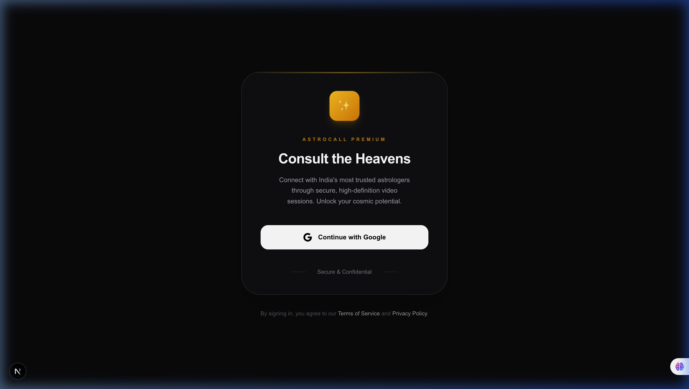
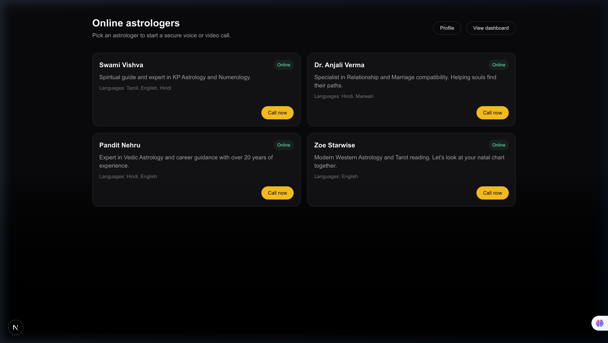
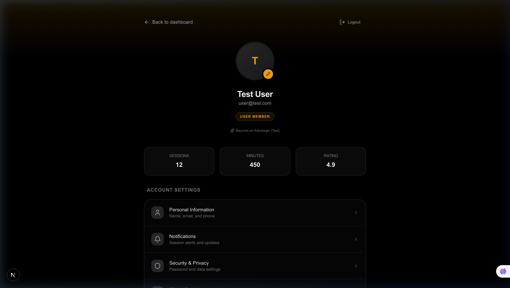
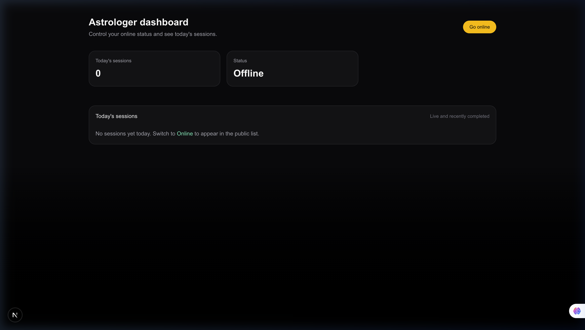

# AstroCall v1 

Consult the heavens with India's most trusted astrologers through secure, high-definition video sessions. AstroCall is a modern platform built for seamless celestial guidance.
## 📸 Visual Tour

| Premium Login | Astrologer Directory |
| :---: | :---: |
|  |  |

| User Profile | Astrologer Dashboard |
| :---: | :---: |
|  |  |


## 🌟 Key Features
- **Real-time Video & Voice**: Crystal clear communication powered by LiveKit.
- **Premium Aesthetics**: Glassmorphic UI with modern dark mode and smooth animations.
- **Role-Based Access**: Dedicated environments for both Users and Astrologers.
- **Session Management**: Track call durations, status, and history.
- **Rating System**: Integrated feedback loop for quality assurance.

## 🎭 Roles & Permissions

### 👤 User
- **Discovery**: Browse the list of online astrologers in real-time.
- **Engagement**: Start instant video sessions with one click.
- **Dashboard**: Track past sessions, guidance minutes, and leave ratings.
- **Profile**: Manage personal identity and account settings.

### 🔮 Astrologer
- **Presence**: Toggle "Online" status to appear in the public directory.
- **Management**: Dedicated dashboard to track today's sessions and active calls.
- **Professionalism**: Secure, private environment to consult with seekers.

## 🛠️ Tech Stack
- **Frontend**: Next.js 16 (App Router), Tailwind CSS, Lucide Icons.
- **Real-time**: LiveKit Cloud & LiveKit Components.
- **Backend/Auth**: Firebase Auth & Firestore.
- **Styling**: Premium Glassmorphism & Framer Motion.

## 🚀 Local Setup & Development

### 1. Prerequisites
- Node.js 18+
- Firebase CLI (`npm install -g firebase-tools`)

### 2. LiveKit Token Server
```bash
cd livekit-server
npm install
node server.js
```
*Runs on http://localhost:5005*

### 3. Firebase Emulators
```bash
# In the root directory
npx firebase-tools emulators:start --only auth,firestore
```
*Management UI on http://localhost:4000*

### 4. Frontend
```bash
cd astrocall-web
npm install
npm run dev
```
*Next.js runs on http://localhost:3000*

## 🔐 Tester Accounts
- **User**: `user@test.com` / `password123`
- **Astrologer**: `astro@test.com` / `password123`

---

